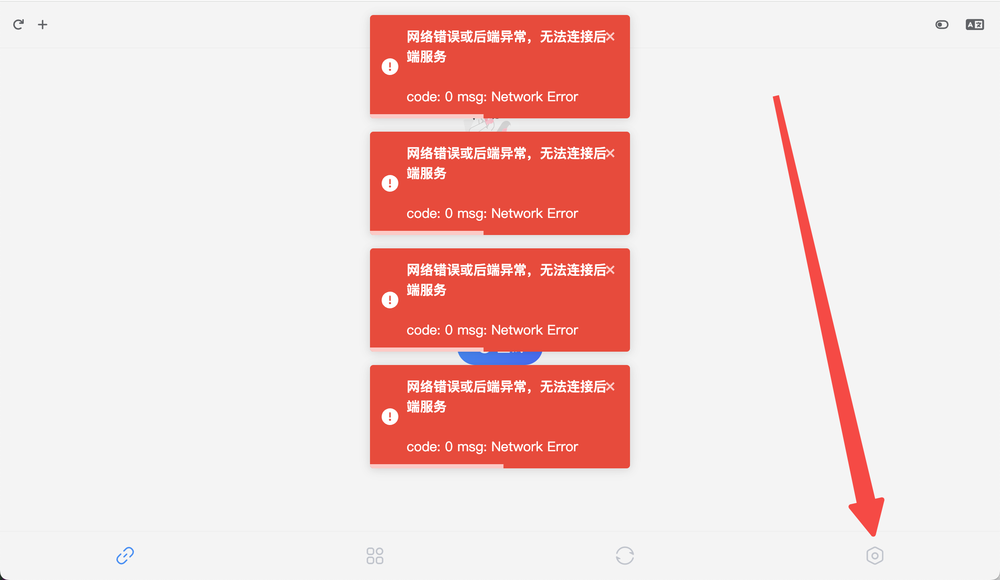
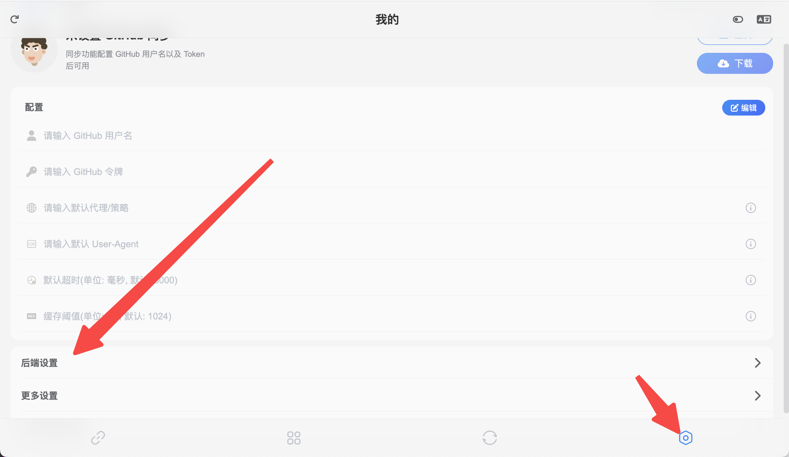
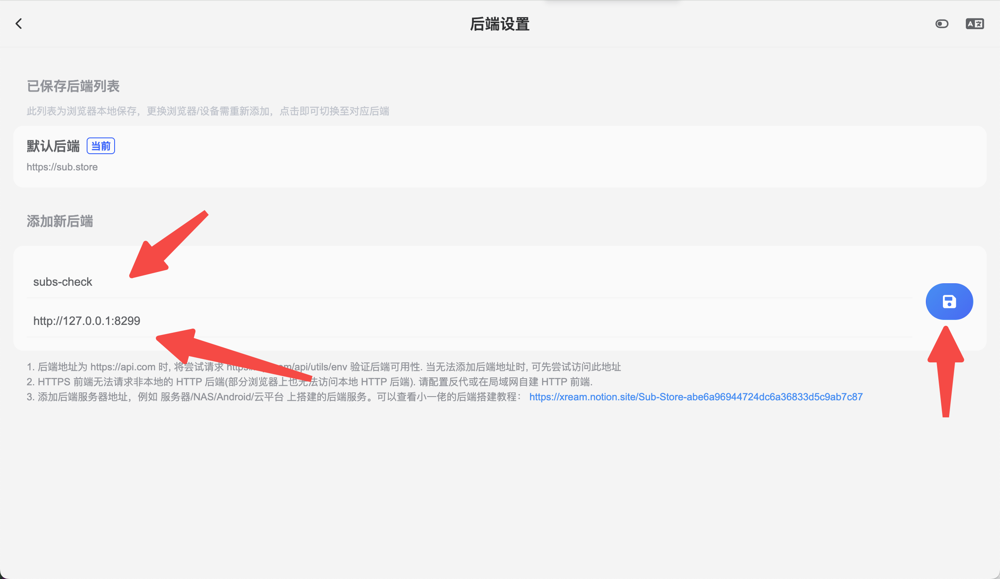
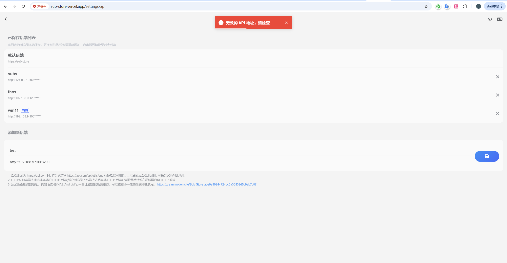
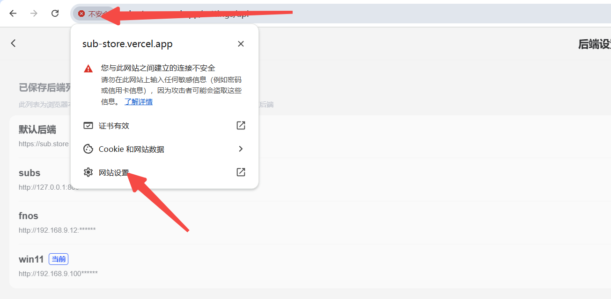
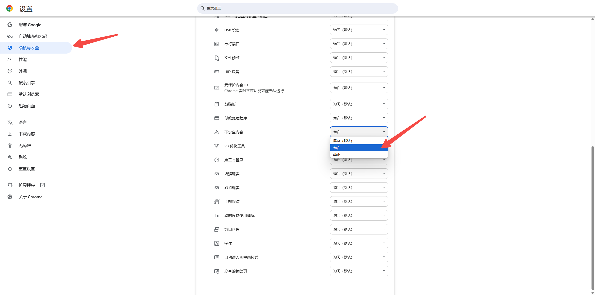
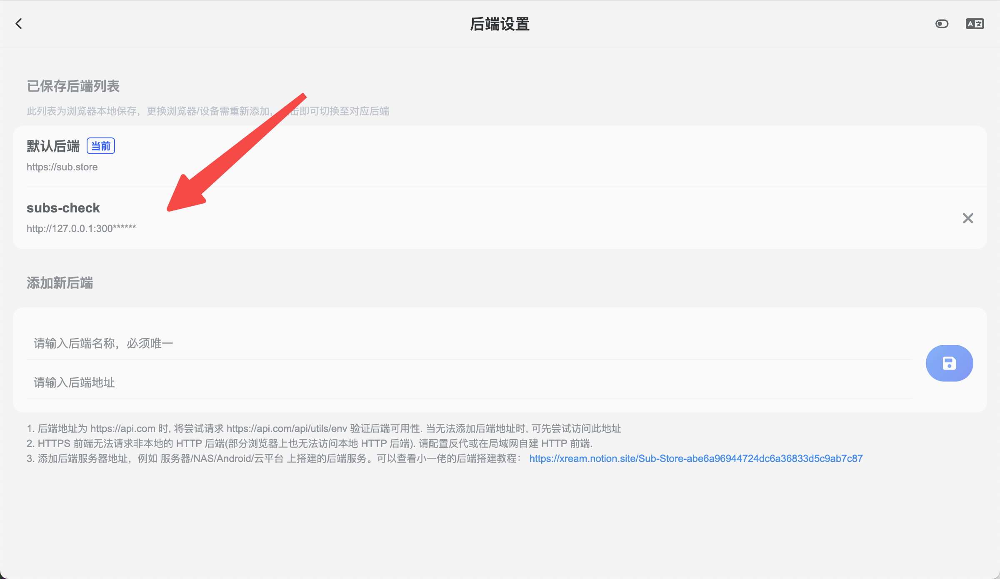
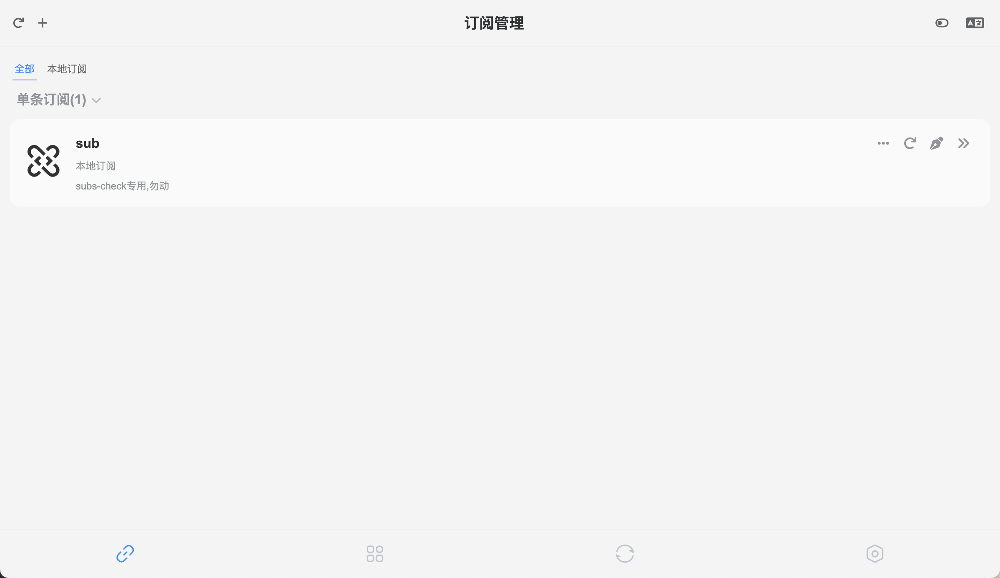
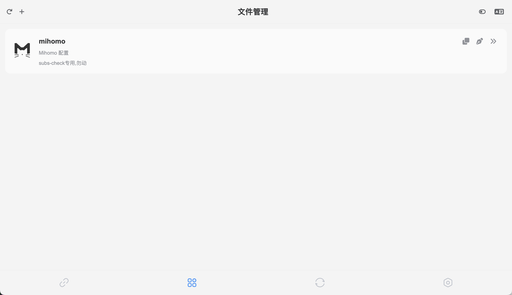

# Sub-Store Backend Tutorial

> ~~When you open `http://127.0.0.1:8299`, it redirects to `https://sub-store.vercel.app/subs`~~ The new version has changed.

> Don't panic! Don't panic! Don't panic!

> The program is fine, you are fine. Sub-store is a frontend-backend separated project. You accessed the backend directly, and it redirected you to the public frontend page.

> So you just need to configure the backend address, and you can operate the backend directly.

## Direct access redirects here
> If your network is poor, this page may not open at all

## Settings in the bottom right corner

## Fill in the name and save the backend address

## There should normally be an error (because browsers don't allow HTTPS frontend to access HTTP backend)

> **Solution for Chrome-based browsers**: Other browsers have similar issues, search for the solution yourself.

> Solution from a contributor: HTTPS frontend cannot request non-local HTTP backend (some browsers also can't access local HTTP backend). Configure a reverse proxy or build an HTTP frontend in your local network.

## Switch to your added backend

## Subscription management page
> Subscriptions without rules come from here

## File management page
> mihomo.yaml files with rules come from here

## Want to DIY?

Create new subscriptions or files based on the original, don't modify the dedicated subs-check configuration!!!

## Security / Custom Path
> If you have security concerns, modify the custom path in the config
